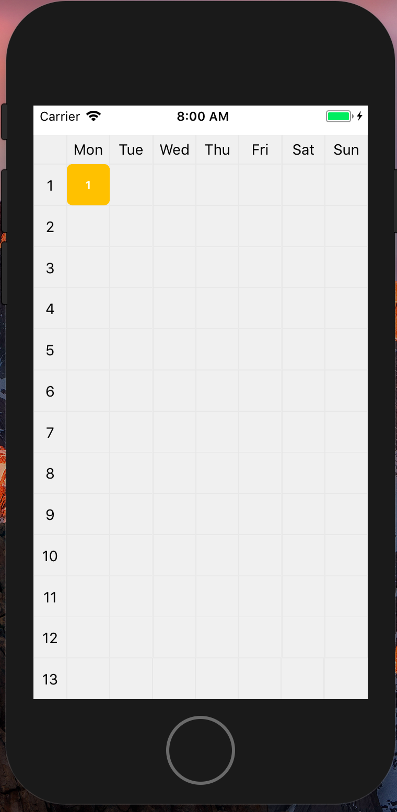

# TimeTable-iOS

[](https://travis-ci.org/yzyzsun/CurriculaTable)
[](https://github.com/Carthage/Carthage)
[](http://cocoapods.org/pods/CurriculaTable)
[](http://cocoapods.org/pods/CurriculaTable)
[](http://cocoapods.org/pods/CurriculaTable)

A simple timetable written in Swift.
forked from [CurriculaTable](https://github.com/yzyzsun/CurriculaTable)

## Installation

### Carthage

```
github "spb829/TimeTable-iOS"
```

### Cocoapods

```ruby
pod "TimeTable-iOS"
```

## Usage

You can refer to `TimeTableDemo`. Details are to be supplemented.

## Screenshot


